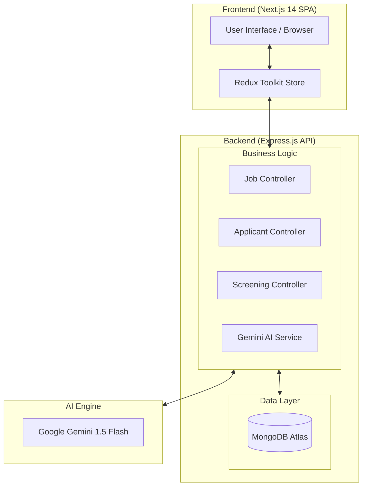
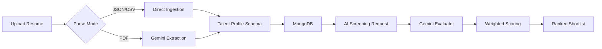

# Umurava AI Recruiter - Talent Screening Platform


A professional, AI-powered talent screening platform designed for the **Umurava AI Hackathon**. This platform automates the evaluation of candidates using the **Google Gemini 1.5 Flash API**, ensuring fair, structured, and rapid recruitment at scale.

---

## 🌐 Architecture Overview

### High-Level System Architecture
The platform follows a modern decoupled architecture with a robust Express.js backend and a high-performance Next.js frontend.



### Component Interaction Flow
How the platform processes candidates from ingestion to AI-ranked shortlists.



---

## 🛠 Tech Stack

### Frontend
- **Framework**: Next.js 14 (App Router)
- **Language**: TypeScript
- **State Management**: Redux Toolkit (RTK Query for API sync)
- **Styling**: Tailwind CSS
- **Visualization**: Recharts (Analytics & Metrics)
- **Icons**: Lucide React

### Backend
- **Server**: Node.js + Express.js
- **Database**: MongoDB Atlas + Mongoose (ODM)
- **AI Integration**: Google Generative AI (Gemini 1.5 Flash)
- **Parsers**: `pdf-parse` (Text extraction), `csv-parser`
- **Security**: Helmet, CORS, Express-rate-limit

---

## 🧠 AI Screening Engine

The core of the platform is the **Gemini 1.5 Flash** integration, which performs deep qualitative analysis.

### Weighted Scoring Formula
To ensure reliability, the final `matchScore` is calculated programmatically (not by the LLM) based on 4 dimensions:

| Dimension | Weight | Description |
|---|---|---|
| **Skills Match** | 40% | Alignment with required & nice-to-have skills |
| **Experience** | 30% | Years of relevant experience & role quality |
| **Education** | 15% | Academic relevance & degree level |
| **Cultural Fit** | 15% | Headline, bio, and project alignment |

```typescript
matchScore = Math.round(
  (skillsScore * 0.40) + 
  (experienceScore * 0.30) + 
  (educationScore * 0.15) + 
  (culturalFitScore * 0.15)
)
```

---

## 📋 Talent Profile Schema (Compliance)

The platform is **100% compliant** with the standard Talent Profile Schema. All candidate data is structured to ensure fair and accurate evaluation.

### Core Data Structure
- **Basic Info**: `firstName`, `lastName`, `email`, `headline`, `location`, `bio`
- **Skills**: `name`, `level` (Beginner to Expert), `yearsOfExperience`
- **Experience**: `company`, `role`, `startDate`, `endDate`, `technologies`, `isCurrent`
- **Education**: `institution`, `degree`, `fieldOfStudy`, `startYear`, `endYear`
- **Projects**: `name`, `description`, `technologies`, `role`, `link`
- **Availability**: `status`, `type` (Full-time, Part-time, Contract)

---

## 🎯 Core Features

1.  **Job Management**: Create and track requirements for multiple positions.
2.  **Smart Ingestion**: 
    - **PDF**: Automatic resume parsing using AI.
    - **CSV/JSON**: High-speed bulk ingestion.
3.  **AI Evaluator**: Batch-processed candidate ranking (max 20 per call).
4.  **Shortlist Export**: Download top candidates in CSV format with AI insights.
5.  **Analytics Dashboard**: Real-time metrics on candidate pool quality.

---

## ⚙️ Setup & Deployment

### Prerequisites
- Node.js 18.x
- MongoDB Atlas (Cloud) or Local MongoDB
- Google Gemini API Key

### 1. Backend Configuration
```bash
cd backend
npm install
# Create .env file:
PORT=5000
MONGODB_URI=your_mongodb_uri
GEMINI_API_KEY=your_gemini_key
FRONTEND_URL=http://localhost:3000
npm run dev
```

### 2. Frontend Configuration
```bash
cd frontend
npm install
# Create .env.local file:
NEXT_PUBLIC_API_URL=http://localhost:5000/api
npm run dev
```

---

## 🌐 API Reference

| Endpoint | Method | Description |
|---|---|---|
| `/api/jobs` | `POST` | Create a new job requirement |
| `/api/applicants/pdf/:jobId` | `POST` | Upload and AI-parse a PDF resume |
| `/api/screening/run` | `POST` | Trigger AI screening for a job |
| `/api/analytics` | `GET` | Fetch platform-wide recruiting metrics |

---

## 🔐 Security & Reliability
- **Data Integrity**: Enforced schema validation at the database level.
- **Security**: XSS and CSRF protection via Helmet.js.
- **AI Stability**: Prompt engineering with strict JSON output schemas to prevent hallucinations.

---

## 📄 License
This project is licensed under the MIT License - see the LICENSE file for details.
